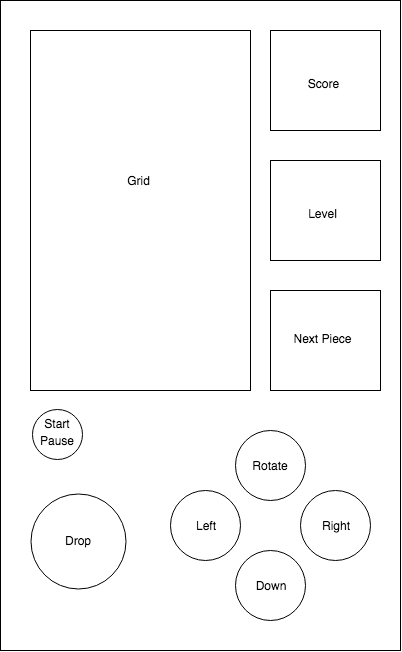

# Tetris

### Background

"Tetriminos" are game pieces shaped like tetrominoes, geometric shapes composed of four square blocks each. A random sequence of Tetriminos fall down the playing field (a rectangular vertical shaft, called the "well" or "matrix"). The objective of the game is to manipulate these Tetriminos, by moving each one sideways (if the player feels the need) and rotating it by 90 degree units, with the aim of creating a horizontal line of ten units without gaps. When such a line is created, it disappears, and any block above the deleted line will fall. When a certain number of lines are cleared, the game enters a new level. As the game progresses, each level causes the Tetriminos to fall faster, and the game ends when the stack of Tetriminos reaches the top of the playing field and no new Tetriminos are able to enter.

### Functionality and MVP#

In this game, users will be able to:
- [ ] Start, pause, and quit the game
- [ ] Rotate, speed up the descent of Tetrimonos, and allow the Tetriminos to drop immediately

### Wireframes#
This app will consist of a single screen with game board, preview screen for the next piece, stats on the current game, instructions on which key presses lead to which actions. Game controls include the up arrow to rotate a piece 90 degrees clockwise, left and right arrows to move the piece of one tile left or right respectively, the down arrow to increase the speed of the piece's descent, and the space bar to instantly drop the piece.

### Architecture and Technologies#

This project will be implemented with the following technologies:
* Vanilla DOM for starting the game, pausing the game, and quitting the game;
* HTML5 Canvas for drawing the game's grid and the moving pieces; and
* Webpack to bundle and serve up the various scripts.

### Implementation Timeline#

**Phase 1**: Set up Node modules, including getting Webpack up and running. Implement a grid and a generic (base) class for the shapes. Add a class for the single square shape, block square shape, long shape, twisted shape and for the three-way shape.

**Phase 2**: Make the shapes move across the grid and give some restrictions to the shapes movement. Implement the board's ability to clear rows and move the rows above that cleared row down.

**Phase 3**: Handle the user keystrokes for the user interaction with the game, including rotation, the down arrow (to increase the speed of descent), and the space bar (to immediately drop the piece). Implement increases in descent speed from increasing levels and style the game.

### Bonus features#

- [ ] Choose a level when starting the game
